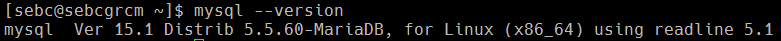

* MariaDB hostname: `sebcgrcm`
* `The command screenshot to display the DB version`

* `The command and output for listing databases`
```
MariaDB [(none)]> show databases;
+--------------------+
| Database           |
+--------------------+
| information_schema |
| hive               |
| hue                |
| mysql              |
| oozie              |
| performance_schema |
| rman               |
| scm                |
| sentry             |
+--------------------+
9 rows in set (0.00 sec)
```